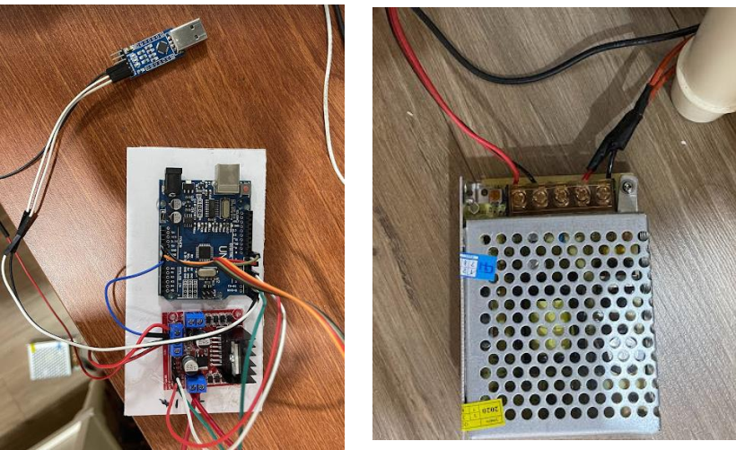
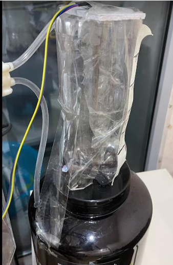
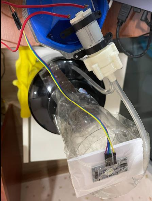
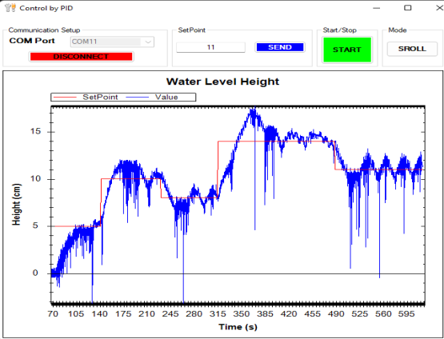

# INTRODUCE
Fixed water level control according to the preset speed.
Use C# to display as well as control.
***
# HARDWARE 
#### List of main devices
- **Arduino**: controls H-bridge and transmits signals to C# applications via UART.
- **L298 V3**: control the water pump motor.
- **Ultrasonic sensor HY-SFR05**: reads and returns the height of the water level.
- **USB UART**: transmit and receive signals between Arduino and C# application.
#### Connection && Result

***
# SOFTWARE
**Ultrasonic sensor processing algorithm**: 
- The time from when the sensor transmits the sound wave to when it is received is the time that the ECHO pin is HIGH. To calculate the distance to the obstacle, just take the speed of sound in the air (340m/s) times the time then / 2 (because the distance here is the total distance from the sensor to the obstacle and from the obstacle about sensors).
**GUI**: 
- Use the PID controller to control the water level of the SetPoint.

**Code**: [link code][1]
***
# REPORT
[link report][2]

[1]: <https://github.com/lhkhanh080720/HCMUT_Parking_System/tree/main/Code/Main_STM/Main>
[2]: <https://github.com/lhkhanh080720/HCMUT_Parking_System/blob/main/Step%201/MAIN_DO_AN.mp4>
[3]: <https://github.com/lhkhanh080720/HCMUT_Parking_System/blob/main/Report/B%C3%A1o%20c%C3%A1o%20%C4%90%E1%BB%93%20%C3%A1n%20(L%C3%AA%20H%E1%BB%AFu%20Kh%C3%A1nh%20-%20B%C3%B9i%20Trung%20Ki%C3%AAn).pdf>

